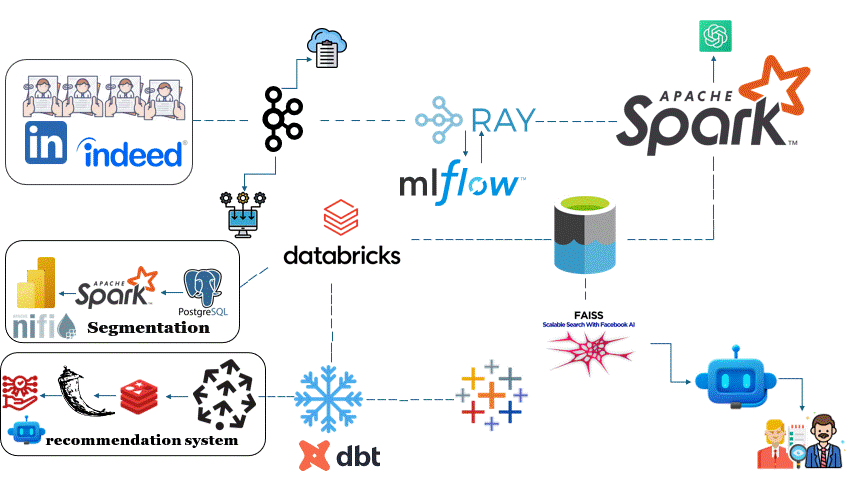
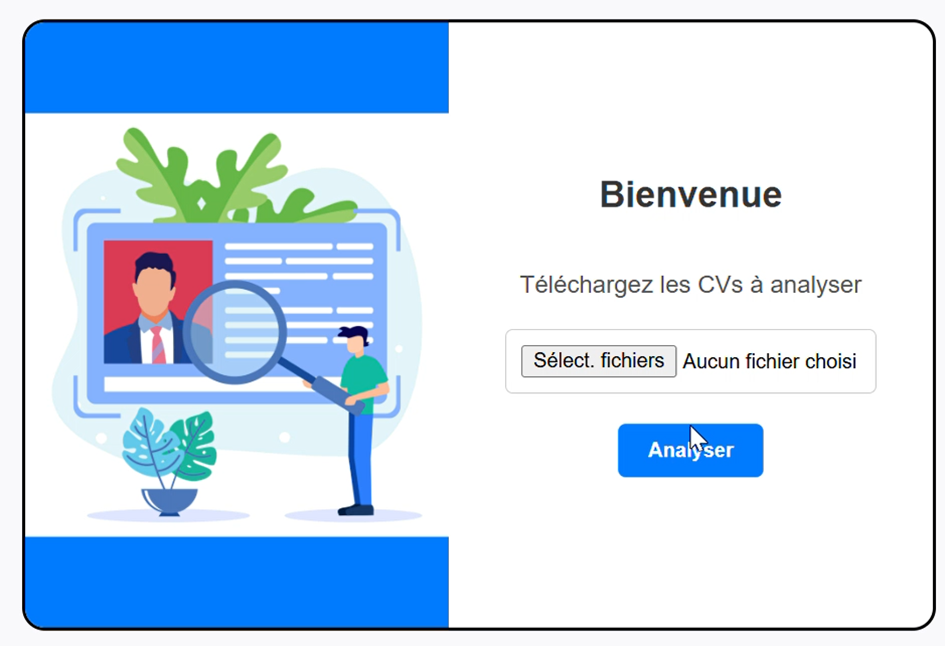
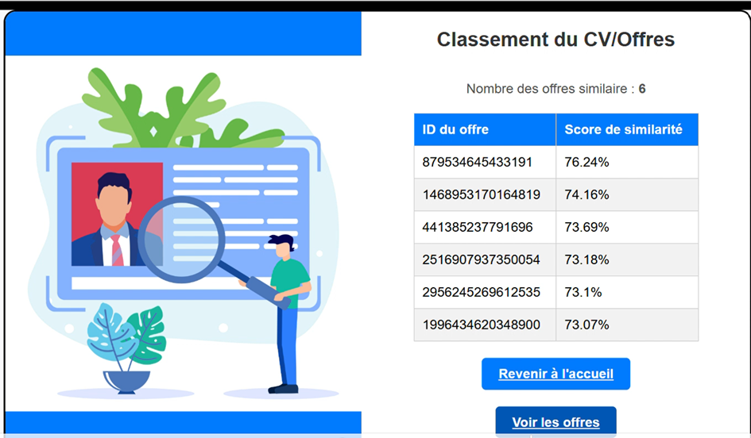

# titre
Generate synthetic Spotify music stream dataset to create dashboards. Spotify API generates fake event data emitted to Kafka. Spark consumes and processes Kafka data, saving it to the Datalake. Airflow orchestrates the pipeline. dbt moves data to Snowflake, transforms it, and creates dashboards.

# Dataset Simulation

- **Job Offers**: Leveraged web scraping on platforms like LinkedIn and other job boards to collect data on job postings. This includes job titles, companies, locations, descriptions, requirements, and more.

- **CV Data**: Incorporated a pre-existing database of CVs containing information such as names, skills, professional experiences, educational backgrounds, and languages.

- **Offer Simulation**: Generated simulated job offers using Llama (via the Groq API), enriching the dataset with synthetic postings tailored to various industries and locations.

#  Processing Pipeline

## Overview
In this project, we simulate job offers and CVs using **Llama** to generate synthetic data, which is sent to **Kafka** for real-time processing. Afterward, **Ray** is used for classification of CVs, job offers, and other data. The data is then processed by **Spark** to extract information in JSON format, which is saved in **Delta Tables** for further analysis in **Databricks**. 

From Databricks, the data is moved to **Snowflake** for storage and transformation with **dbt**. **Pinecone** and **Redis** are utilized for data indexing and caching, respectively, while a **Flask** server is set up for machine learning model deployment. Additionally, the system is integrated with a chatbot based on **FISS**.

We also have a segmentation process, where data flows from **Postgres** to **Spark** and finally to **Tableau** for visualization.

## Tools & Technologies

- **Data Simulation**: 
  - **Llama**: Used to generate synthetic job offers and CVs.
  
- **Message Queue**: 
  - **[Kafka](https://kafka.apache.org/)**: Sends simulated job offers and CVs to the processing pipeline.

- **Classification**: 
  - **[Ray](https://www.ray.io/)**: Classifies job offers, CVs, and other data.

- **Data Processing**: 
  - **[Apache Spark](https://spark.apache.org/)**: Processes the data, extracting it in JSON format.
  - **[Databricks](https://www.databricks.com/)**: Used for further processing and analytics.

- **Data Storage**:
  - **[Delta Lake](https://delta.io/)**: Used for efficient data storage and versioning.
  - **[Snowflake](https://www.snowflake.com/en/)**: Cloud data warehouse for storage and querying.

- **Data Transformation**: 
  - **[dbt](https://www.getdbt.com/)**: Used for data transformations in Snowflake.

- **Data Indexing & Caching**:
  - **[Pinecone](https://www.pinecone.io/)**: Data indexing and similarity search.
  - **[Redis](https://redis.io/)**: Used for caching and quick access.

- **Machine Learning Model Deployment and User Interface**:
  - **[Flask](https://flask.palletsprojects.com/)**: Provides the system's user interface where users can upload a CV and receive job offers recommendations, or upload a job offer and receive candidate recommendations. It also allows users to interact with the CVs of recommended candidates through a chatbot.

- **Data Segmentation**:
  - **[Postgres](https://www.postgresql.org/)**: Used for storing data before segmentation.
  - **[Spark](https://spark.apache.org/)**: Handles data segmentation of candidate profiles.
  - **[Tableau](https://www.tableau.com/)**: Visualizes the segmented data for insights from the data warehouse.
  - **[Apache NiFi](https://nifi.apache.org/)**: Orchestrates and automates the segmentation process, ensuring smooth data flow and transformation.

- **Chatbot Integration**: 
  - **[FAISS](https://github.com/facebookresearch/faiss)**: A vector database that allows recruiters to interact with and discuss candidate CVs recommended by the system.

- **Programming Language**: 
  - **[Python](https://www.python.org/)**: The primary language used for the development and deployment of the system.

---

Feel free to explore and analyze the data simulation and processing pipeline to uncover valuable insights into job offers, candidate profiles, and real-time data interactions. If you have any questions or need further information, refer to the provided documentation or contact the project contributors.

# Architecture

# Final Result and User Interface Images

1. **CV Upload and Recommendations Interface**:  
   This interface allows users to upload their CV and receive a list of recommended job offers.
   
   
   

2. **Job Offer Upload and Candidate Recommendations**:  
   In this part of the interface, users can upload a job offer and receive a list of recommended candidates.
   
   

3. **Chat with Candidate CVs**:  
   Here, users can interact with the CVs of recommended candidates through a chatbot to discuss details.
   
   

4. **Candidate Segmentation Dashboard**:  
   This dashboard visualizes the segmentation of candidates for better insights into their profiles.
   
   

# Project Flow

- Setup Free Azure account & Azure Keyvault - **[Setup](https://github.com/abdkumar/spotify-stream-analytics/blob/main/setup/azure.md)**
- Setup Terraform and create resources - **[Setup](https://github.com/abdkumar/spotify-stream-analytics/blob/main/setup/terraform.md)**
- SSH into VM (kafka-vm)
  - Setup Kafka Server - **[Setup](https://github.com/abdkumar/spotify-stream-analytics/blob/main/setup/kafka.md)**
  - Setup Spotify API account & Generate Spotify Stream Events Data - **[Setup](https://github.com/abdkumar/spotify-stream-analytics/blob/main/setup/data.md)**
  - Setup Spark streaming job - **[Setup](https://github.com/abdkumar/spotify-stream-analytics/blob/main/setup/spark.md)**
- Setup Snowflake Warehouse - **[Setup](https://github.com/abdkumar/spotify-stream-analytics/blob/main/setup/snowflake.md)**
- Setup Databricks Workspace & CDC (Change Data Capture) job - **[Setup](https://github.com/abdkumar/spotify-stream-analytics/blob/main/setup/databricks.md)**
- SSH into another VM (airflow-vm)
  - Setup dbt models - **[Setup](https://github.com/abdkumar/spotify-stream-analytics/blob/main/setup/dbt.md)**
  - Setup airflow - **[Setup](https://github.com/abdkumar/spotify-stream-analytics/blob/main/setup/airflow.md)**

# How can I make this better?!
A lot can still be done :).

- Choose managed Infra
  - Confluent Cloud for Kafka
- Write data quality tests
- Include CI/CD
- Add more visualizations

