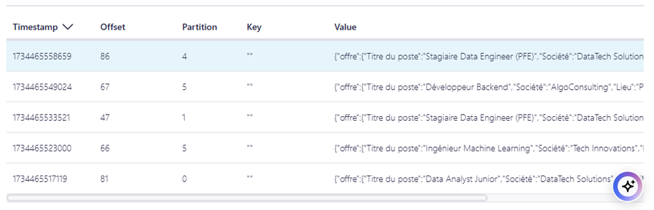

# Setup Kafka Cluster and Data Generator

We will set up Kafka using a **cloud-based Confluentic cluster** and a data generator on a dedicated compute instance. A Python data generator script will produce offres/CV's stream events and send them to the Kafka cluster.

## Architecture Overview
Below is the architecture diagram for the Kafka setup using Confluentic:  


---

## Steps to Set Up Kafka with Confluentic

### 1. Set Up the Confluentic Kafka Cluster  
1. **Log in to Confluent Cloud**  
   Access the [Confluent Cloud Platform](https://www.confluent.io/confluent-cloud/).  
   
2. **Create a Kafka Cluster**  
   - Navigate to the **Clusters** section.  
   - Click **Create Cluster** and select the appropriate cluster type (Basic, Standard, or Dedicated).  
   - Follow the wizard to configure the cluster (region, cloud provider, etc.).
   
   
   


3. **Generate API Keys**  
   - Once the cluster is created, go to **API Keys** under the cluster settings.  
   - Generate an API key and secret to authenticate your client.  

4. **Set Up a Kafka Topic**  
   - In the cluster, navigate to **Topics**.  
   - Create a new topic (e.g., `offres_trav`) and configure the partitions as needed.  
   

---

### 2. Install and Configure Kafka Clients  
To connect to the Confluentic cluster, configure the Kafka client on your local machine or server:

1. **Download the Kafka Client**  
   Install the Confluent CLI for seamless cluster interaction:  
   ```bash
   curl -L --http1.1 https://cnfl.io/cli | sh -s -- -b /usr/local/bin

### 3. Result




